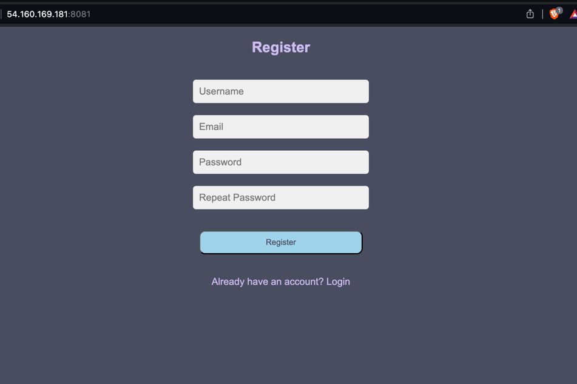
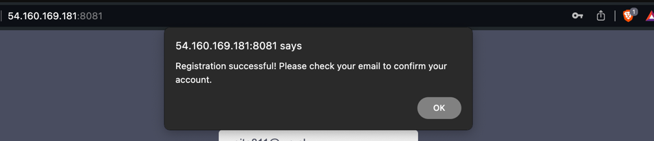
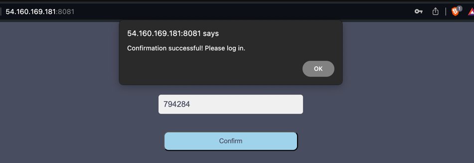
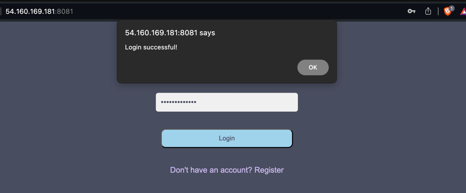
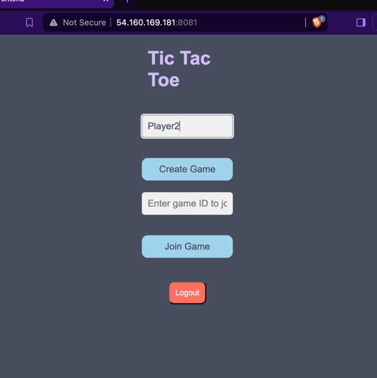
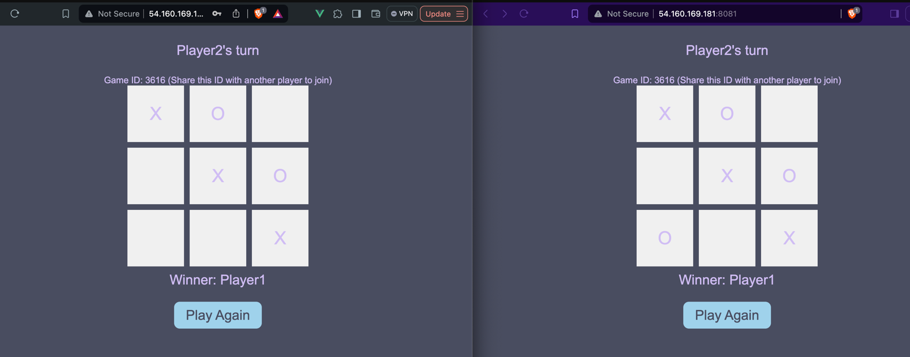

# Wojciech Skuła - Terraform, EC2, TicTacToe report

- Course: *Cloud programming*
- Group: Group 4 
- Date: 04.06.2024

## Environment architecture

Description and scheme of the developed infrastructure.
- VPC: A Virtual Private Cloud (VPC) named "TicTacToeVPC" with a CIDR block of "10.0.0.0/16".
- Subnet: A public subnet named "TicTacToeSubnet" within the VPC with a CIDR block of "10.0.1.0/24".
- Internet Gateway: An internet gateway named "TicTacToeIGW" to enable internet access for the resources in the VPC.
- Route Table: A route table named "TicTacToeRouteTable" with a route to the internet gateway.
- Route Table Association: An association between the route table and the public subnet to allow internet traffic from the subnet.
- Security Group: A security group named "TicTacToeSG" that allows SSH, HTTP, and custom port 8080-8081 traffic inbound from anywhere (0.0.0.0/0) and allows all outbound traffic.
- IAM Instance Profile: An IAM instance profile named "tic-tac-toe-profile" that can be attached to EC2 instances. This profile is currently not assigned a role.
- EC2 Instance: A single EC2 instance named "TicTacToeInstance" launched in the public subnet with the "t2.micro" instance type. The user data script for the instance installs Docker, Docker Compose, clones a git repository, and starts the Tic Tac Toe application using Docker Compose. The script also retrieves the instance's public IP address and stores it in an environment variable.
- Cognito User Pool : Creates a user pool named "tic-tac-toe-user-pool". This resource is likely intended to provide user authentication for the Tic Tac Toe application.
- Cognito User Pool Client : Creates a user pool client named "tic-tac-toe-cognito-client". This resource is likely used with the Cognito user pool to allow users to sign in to the Tic Tac Toe application.
## Preview

Screenshots of configured AWS services. Screenshots of your application running.

 

## Reflections

- What did you learn?
  How to integrate Cognito service with the application.
- What obstacles did you overcome?
  I had some issues with configuration of Amplify package. Also with authenticating JWT token, but managed to resolve this.
- What did you help most in overcoming obstacles?
  Amplify documentation and stackoverflow.
- Was that something that surprised you?
  Not really.
  
